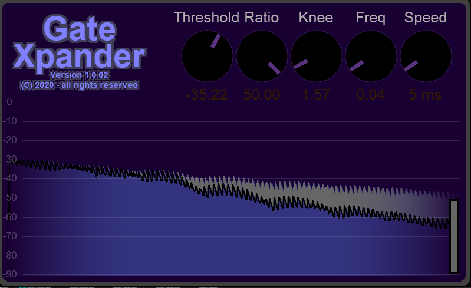
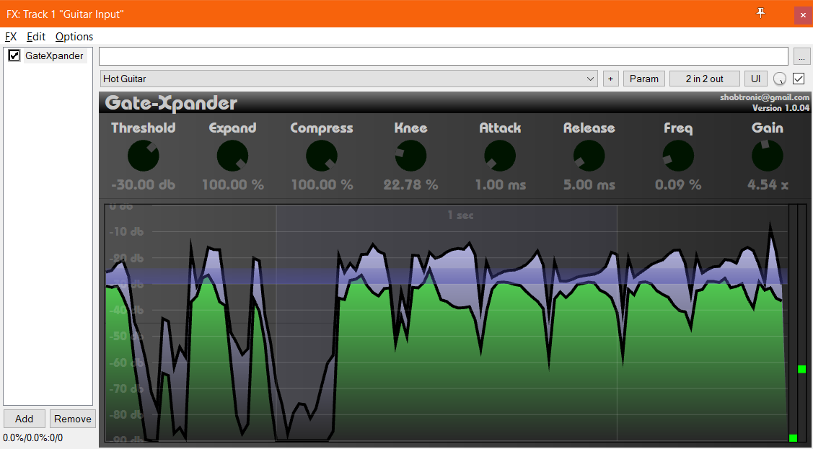

# GateXpander
Audio compressor, expander with noise gate functionality, it's only really good for distorted guitar (since my code currently distorts too much for clean sounds).

if Ratio is > 0 the Expander algorithm kicks in.

if Ratio is <0 the Compressor algorithm kicks in.

Here are some settings for a great noise gate for High gain guitar!

Reaper JS version:

VST3 Version:

written using the excellent Iplug2 framework  (https://github.com/iPlug2/iPlug2)

This version has a seperate compress level - this mirrors when the knee level is above 0%.
it mirrors around the threshold value - so if the signal is above that value - it will pull the signal below the threshold level
by the same amount  - this gives that class "suckback" sound.

For guitar this means the harder you hit the strings the more the sound will fade in - this is great for slow power chord control.

Currently the VST3 factory presets are broken for some unknown reason.

The blue graph is the original signal, the green graph is the processed signal.

The graph and detector use a simple abs-peak-leaky system.

How does this work/what does it do?

This VST is mainly a downward expander. When the signal level drops below a user defined threshold - it turns the gain down so the signal goes lower. The amount it turns the gain down is directly proportional to the signal value difference from the threshold - so the lower the signal - the more it turns it down. The expand control also controls the amount it turns the gain down (this is actually a ratio control). This works great as a soft noise gate.

What does the compress control do?

if the signal rises above the threshold - it will change the gain to make the signal hold at the threshold value.

What does the Knee control do?

It smooths the amount of gain change based on the signal distance from the Threshold value - this stops abrupt changes that cause distortion.

With the Compress control above 0% - when the Knee amount is above 0% it will start to mirror the signal about the threshold access - this is super handy for "suckback/pumping" sounds.

Here's a example of the expander used on a fast technical riff

(https://soundcloud.com/shabtronica/technicaldifficultiestone?in=shabtronica/sets/technical-difficulties-tone)
